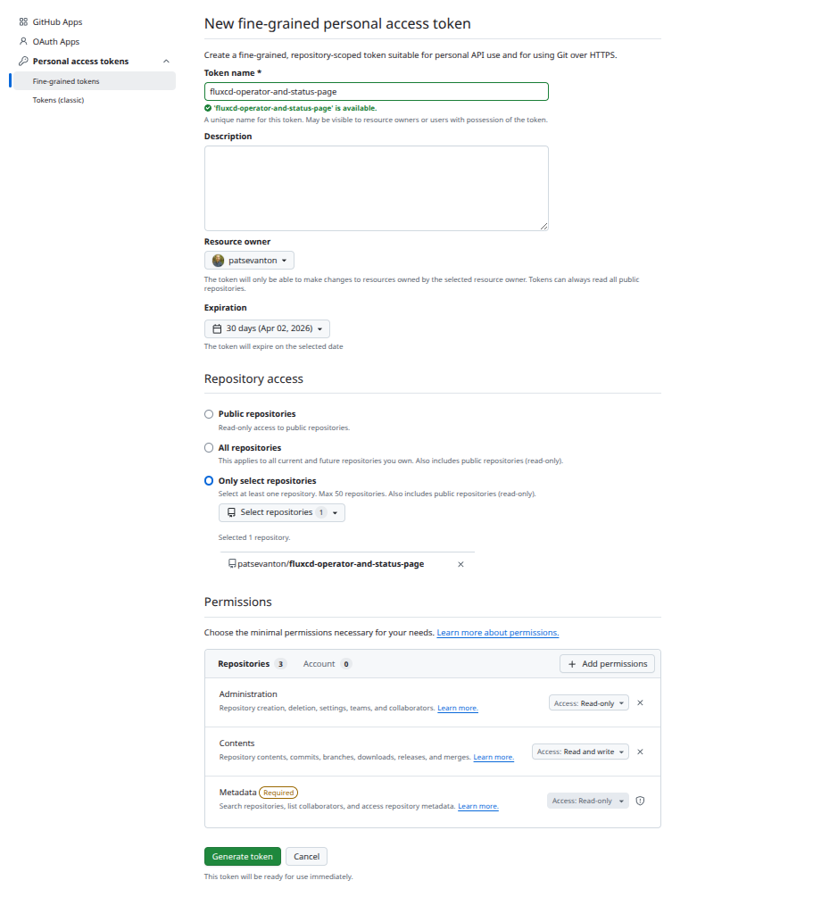

# От Flux CLI к Flux Operator и Status Page: один репозиторий — полный путь

Когда вы впервые поднимаете GitOps в Kubernetes, **Flux CD** кажется достаточным: `flux bootstrap`, манифесты в Git, контроллеры тянут состояние кластера. 

Но лучше перейти на Flux Operator:

- **Декларативный дистрибутив** — версия, реестр образов и состав контроллеров в **FluxInstance** вместо ручного сопровождения манифестов `gotk-components`.
- **Единая синхронизация с Git** — `FluxInstance.spec.sync` вместо разрозненной ручной сборки нескольких объектов.
- **Обновления и откат через Git** — с тем же аудитом и ревью, что и для приложений.
- **Наблюдаемость** — отчёты, метрики и **Status Page**, не только `flux get` в CLI.
- **Привычный GitOps** — `GitRepository`, `Kustomization`, `HelmRelease` остаются; меняется способ **установки и жизненного цикла** самого Flux.

Здесь зафиксирован путь от классического bootstrap к **[Flux Operator](https://fluxoperator.dev/)** (**FluxInstance**) и **FluxCD Status Page**.

## Как устроен репозиторий FluxCD у меня

| Путь | Роль |
|------|------|
| [base/kustomization.yaml](base/kustomization.yaml) | Корневой kustomize: `flux-system` + [apps.yaml](base/apps.yaml) |
| [base/apps.yaml](base/apps.yaml) | Flux `Kustomization`: **victoria-metrics**, **prometheus-crds**, **flux-operator** |
| [base/flux-system/](base/flux-system/) | Классический bootstrap: `gotk-components.yaml`, [gotk-sync.yaml](base/flux-system/gotk-sync.yaml). После перехода на оператор — [flux-instance.yaml](base/flux-system/flux-instance.yaml) |
| [apps/](apps/) | [apps/kustomization.yaml](apps/kustomization.yaml) — локальный `kustomize build apps/` |

**Нюанс раскладки:** при первом `flux bootstrap` CLI по умолчанию кладёт `flux-system/` в корень репозитория. Содержимое `base/` и `apps/` вы коммитите в Git до или после bootstrap — главное, чтобы путь в bootstrap совпадал с тем, что ожидает кластер.


## Часть 1. Классический Flux: bootstrap и приложения

### Предварительные условия

- Чистый кластер Kubernetes.
- **Flux CLI** — [Installing the Flux CLI](https://fluxcd.io/flux/installation/). Проверка: `flux version --client`.
- Доступ к Git-репозиторию для `flux bootstrap`; при необходимости — PAT (см. ниже).

### GitHub Personal Access Token для bootstrap

Для `flux bootstrap github` токен передаётся через `GITHUB_TOKEN` или вводится в интерактиве.



1. [GitHub → Fine-grained tokens](https://github.com/settings/personal-access-tokens/new).
2. **Repository access** — только нужный репозиторий (например `fluxcd-operator-and-status-page`).
3. **Permissions:** **Contents** — Read and write; **Metadata** — Read-only; **Administration** — Read-only.

С флагом `--token-auth` Flux сохраняет PAT в Secret в кластере; для PAT достаточно **Administration → Read-only**.

### Команда bootstrap

```bash
flux bootstrap github \
  --token-auth \
  --owner=patsevanton \
  --repository=fluxcd-operator-and-status-page \
  --branch=main \
  --path=base
```

Фрагмент типичного вывода:

```
Please enter your GitHub personal access token (PAT):
► connecting to github.com
► cloning branch "main" from Git repository "https://github.com/patsevanton/fluxcd-operator-and-status-page.git"
✔ cloned repository
...
✔ all components are healthy
```

Перед проверкой после bootstrap скачайте изменения из Git-репозитория:

```bash
git pull
```

### Проверка после bootstrap

Flux уже синхронизирует ваши приложения. `flux get all -A` показывает состояние всех ресурсов FluxCD.

Команда ниже показывает состояние всех ресурсов FluxCD на которые стоит обратить внимание.
```bash
flux get all -A | grep -v "succeeded" | grep -v Applied | grep -v pulled | grep -v "stored artifact" | grep -v Ready
```

Пример вывода. Видно что broken-demo сломан. broken-demo нужен для тестирования алертов FluxCD.
```
flux get all -A | grep -v "succeeded" | grep -v Applied | grep -v pulled | grep -v "stored artifact" | grep -v Ready
NAMESPACE  	NAME                     	REVISION          	SUSPENDED	READY	MESSAGE                                           

NAMESPACE  	NAME                               	REVISION       	SUSPENDED	READY	MESSAGE                                                                                                                                                       
flux-system	helmrepository/bitnami             	               	False    	False	failed to fetch Helm repository index: failed to cache index to temporary file: failed to fetch https://charts.bitnami.com/bitnami/index.yaml : 403 Forbidden	

NAMESPACE  	NAME                                          	REVISION	SUSPENDED	READY	MESSAGE                                                         
flux-system	helmchart/flux-system-broken-demo             	        	False    	False	no artifact available for HelmRepository source 'bitnami'      	

NAMESPACE  	NAME                                	REVISION	SUSPENDED	READY	MESSAGE                                                                                                                 
flux-system	helmrelease/broken-demo             	        	False    	False	HelmChart 'flux-system/flux-system-broken-demo' is not ready: no artifact available for HelmRepository source 'bitnami'	

NAMESPACE  	NAME                          	REVISION          	SUSPENDED	READY	MESSAGE                              
```

Можно проверить helmreleases kustomizations отдельно.

```
flux get helmreleases -n flux-system
NAME                    	REVISION	SUSPENDED	READY	MESSAGE                                                                                                                 
broken-demo             	        	False    	False	HelmChart 'flux-system/flux-system-broken-demo' is not ready: no artifact available for HelmRepository source 'bitnami'	
prometheus-operator-crds	28.0.1  	False    	True 	Helm install succeeded for release flux-system/prometheus-operator-crds.v1 with chart prometheus-operator-crds@28.0.1  	
vmks                    	0.74.1  	False    	True 	Helm upgrade succeeded for release vmks/vmks.v2 with chart victoria-metrics-k8s-stack@0.74.1 
```

```bash
flux get kustomizations -A
NAMESPACE  	NAME            	REVISION          	SUSPENDED	READY	MESSAGE                              
flux-system	broken-demo     	main@sha1:6f493bf6	False    	True 	Applied revision: main@sha1:6f493bf6	
flux-system	flux-system     	main@sha1:6f493bf6	False    	True 	Applied revision: main@sha1:6f493bf6	
flux-system	prometheus-crds 	main@sha1:6f493bf6	False    	True 	Applied revision: main@sha1:6f493bf6	
flux-system	victoria-metrics	main@sha1:6f493bf6	False    	True 	Applied revision: main@sha1:6f493bf6
```

## Часть 2. Переход на Flux Operator

### Установка Flux Operator

Для установке Flux Operator выполните шаги ниже вручную из корня репозитория.

Создайте файлы из корня репозитория:

```bash
mkdir -p apps/flux-operator

cat <<'EOF' >> base/apps.yaml
---
apiVersion: kustomize.toolkit.fluxcd.io/v1
kind: Kustomization
metadata:
  name: flux-operator
  namespace: flux-system
spec:
  interval: 10m
  sourceRef:
    kind: GitRepository
    name: flux-system
  serviceAccountName: kustomize-controller
  path: ./apps/flux-operator
  prune: true
  wait: true
  timeout: 10m
EOF

cat <<'EOF' > apps/flux-operator/sources.yaml
apiVersion: source.toolkit.fluxcd.io/v1
kind: HelmRepository
metadata:
  name: cp-flux-operator
  namespace: flux-system
spec:
  interval: 24h
  type: oci
  url: oci://ghcr.io/controlplaneio-fluxcd/charts
EOF

cat <<'EOF' > apps/flux-operator/helmrelease.yaml
apiVersion: helm.toolkit.fluxcd.io/v2
kind: HelmRelease
metadata:
  name: flux-operator
  namespace: flux-system
spec:
  interval: 30m
  timeout: 10m
  chart:
    spec:
      chart: flux-operator
      version: "0.47.0"
      sourceRef:
        kind: HelmRepository
        name: cp-flux-operator
        namespace: flux-system
      interval: 30m
  releaseName: flux-operator
  values:
    web:
      enabled: true
      config:
        baseURL: http://flux.apatsev.org.ru/
      ingress:
        enabled: true
        className: nginx
        hosts:
          - host: flux.apatsev.org.ru
            paths:
              - path: /
                pathType: Prefix
EOF
```

Закоммитьте изменения и дождитесь синхронизации: `flux get kustomizations -n flux-system`, `flux get helmreleases -n flux-system`.

Проверка: `flux get helmreleases -n flux-system` (релиз `flux-operator`).

### Создание FluxInstance

Одной установки Flux Operator недостаточно: нужно ещё создать ресурс `FluxInstance`. Он описывает для оператора, какую версию Flux развернуть, какие контроллеры включить и с какого Git-репозитория синхронизировать манифесты. После установки оператора это шаг, который фактически поднимает Flux в кластере и привязывает его к вашему GitOps.

Укажите тот же репозиторий и ветку, что и при bootstrap. Минимальный пример для публичного Git — ниже, совпадает с [base/flux-system/flux-instance.yaml](base/flux-system/flux-instance.yaml) (при необходимости отредактируйте `url`, `ref`; для приватного репозитория используйте `spec.sync.pullSecret` — [документация](https://fluxoperator.dev/docs/instance/sync/#sync-from-a-git-repository)).

Пока CRD `FluxInstance` есть только после установки оператора, первый раз создайте манифест и примените его вручную (после миграции его можно включить в [base/flux-system/kustomization.yaml](base/flux-system/kustomization.yaml), см. ниже):

Важно про источник управления Flux на этапах миграции:

- До переключения `base/flux-system/kustomization.yaml` продолжает ссылаться на `gotk-components.yaml` и `gotk-sync.yaml`, поэтому Flux всё ещё управляется классическим bootstrap.
- После создания и применения `base/flux-system/flux-instance.yaml` ресурс `FluxInstance` уже начинает управлять жизненным циклом Flux.
- Полный переход в Git фиксируется после очистки `gotk-*` и обновления `base/flux-system/kustomization.yaml` на `flux-instance.yaml`.

```bash
mkdir -p base/flux-system

cat <<'EOF' > base/flux-system/flux-instance.yaml
apiVersion: fluxcd.controlplane.io/v1
kind: FluxInstance
metadata:
  name: flux
  namespace: flux-system
spec:
  distribution:
    version: "2.8.x"
    registry: "ghcr.io/fluxcd"
  components:
    - source-controller
    - kustomize-controller
    - helm-controller
    - notification-controller
  sync:
    kind: GitRepository
    url: "https://github.com/patsevanton/fluxcd-operator-and-status-page.git"
    ref: "refs/heads/main"
    path: "./base"
EOF

kubectl apply -f base/flux-system/flux-instance.yaml
```

### Проверка миграции

```bash
kubectl -n flux-system get fluxinstance flux
NAME   AGE     READY   STATUS                           REVISION
flux   2m21s   True    Reconciliation finished in 19s   v2.8.5@sha256:df269637e1cbd79f25263d77f754ec782afb780ad197f4732771f661ceb73f3f
```

```bash
kubectl -n flux-system get pods
NAME                                       READY   STATUS    RESTARTS   AGE
flux-operator-64bbc44d7c-v87fj             1/1     Running   0          40m
helm-controller-65ff4c7c98-fvjg9           1/1     Running   0          2m20s
kustomize-controller-59fc467858-mhsbz      1/1     Running   0          2m20s
notification-controller-6d66bb7797-7wp5r   1/1     Running   0          2m20s
source-controller-7846484bbc-6rfg5         1/1     Running   0          2m19s
```

### Очистка репозитория после миграции

Удалите артефакты классического bootstrap и переключите [base/flux-system/kustomization.yaml](base/flux-system/kustomization.yaml) на один ресурс — `flux-instance.yaml` (он уже лежит рядом и с **`path: "./base"`** в `spec.sync`).

Подробнее: [Flux Bootstrap Migration](https://fluxcd.control-plane.io/operator/flux-bootstrap-migration).

```bash
git rm base/flux-system/gotk-components.yaml
git rm base/flux-system/gotk-sync.yaml
```

Пересоздайте base/flux-system/kustomization.yaml:

```bash
cat <<'EOF' > base/flux-system/kustomization.yaml
apiVersion: kustomize.config.k8s.io/v1beta1
kind: Kustomization
resources:
- flux-instance.yaml
EOF
```

```bash
git add base/flux-system/kustomization.yaml base/flux-system/flux-instance.yaml
```

Закоммитьте изменения.


## FluxCD Status Page

После установки Flux Operator в игру входят **FluxReport**, события по `FluxInstance` и метрики Prometheus.

**Демо-интерфейс:** [http://flux.apatsev.org.ru/](http://flux.apatsev.org.ru/).

### Скриншоты

Файлы удобно складывать в [screenshots/](screenshots/).

| Описание | Файл |
|----------|------|
| Status Page — обзор | `screenshots/flux-status-page-overview.png` |
| Dashboard / Mission Control (если включён) | `screenshots/flux-dashboard.png` |


### FluxReport

Ресурс `FluxReport` `flux` в `flux-system` (обновление по умолчанию раз в 5 минут):

```bash
kubectl -n flux-system get fluxreport/flux -o yaml
```

Принудительное обновление:

```bash
kubectl -n flux-system annotate --overwrite fluxreport/flux \
  reconcile.fluxcd.io/requestedAt="$(date +%s)"
```

[Flux Report API](https://fluxoperator.dev/docs/crd/fluxreport).

### События

```bash
kubectl -n flux-system events --for fluxinstance/flux
```

Уведомления (Slack, Teams и др.) — через notification-controller, [Provider/Alert](https://fluxoperator.dev/docs/crd/provider).

### Метрики

Для Prometheus Operator: `serviceMonitor.create=true` в `values`. Подробнее: [Flux Monitoring and Reporting](https://fluxcd.control-plane.io/operator/monitoring).

## Пример установки приложений через FluxCD

Состав задаётся в [base/apps.yaml](base/apps.yaml).

| Компонент | Namespace | Назначение |
|-----------|------------|------------|
| Flux Operator | flux-system | Оператор Flux, Mission Control, [Status Page](http://flux.apatsev.org.ru/); зависит от `prometheus-crds` для `ServiceMonitor` |
| VictoriaMetrics K8s Stack | vmks | VMSingle, vmagent, vmalert, Alertmanager, Grafana |

Параметры чарта — `spec.values` в [apps/victoria-metrics/helmrelease.yaml](apps/victoria-metrics/helmrelease.yaml).


## Полезные команды

```bash
flux get sources helm
flux get helmreleases -A
flux get kustomizations -A
flux logs --all-namespaces --follow
kubectl get pods -n flux-system
kubectl get pods -n vmks
```


## Устранение неполадок

| Симптом | Что проверить |
|---------|----------------|
| `GitRepository` / `Kustomization` не Ready | `flux get sources git -A`, `kubectl describe gitrepository -n flux-system`, сеть и права PAT / deploy key |
| HelmRelease завис | `flux get helmreleases -A`, логи `helm-controller`, значения в `HelmRelease` |
| После миграции не применяется `base/` | В `FluxInstance.spec.sync.path` должно быть `./base`, если манифесты лежат под `base/` |
| Нет метрик оператора | Service `flux-operator`, порт 8080; при необходимости `ServiceMonitor` |


## Метрики и Grafana

[VictoriaMetrics K8s Stack](https://github.com/VictoriaMetrics/helm-charts/tree/master/charts/victoria-metrics-k8s-stack) поднимает **Grafana** вместе с vmagent, VMSingle и правилами алертинга.

**Веб-доступ:** в этом репозитории для Grafana включён Ingress — [https://grafana.apatsev.org.ru](https://grafana.apatsev.org.ru) (см. [apps/victoria-metrics/helmrelease.yaml](apps/victoria-metrics/helmrelease.yaml)).

Пароль администратора Grafana:

```bash
kubectl get secret vmks-grafana -n vmks -o jsonpath='{.data.admin-password}' | base64 --decode; echo
```

## Ссылки

- [Installing the Flux CLI](https://fluxcd.io/flux/installation/)
- [Flux Documentation](https://fluxcd.io/flux/)
- [Flux Get Started](https://fluxcd.io/flux/get-started/)
- [Manage Helm Releases](https://fluxcd.io/flux/guides/helmreleases/)
- [Flux Operator — Installation](https://fluxoperator.dev/docs/guides/install/)
- [Flux Operator — Cluster sync (GitRepository)](https://fluxoperator.dev/docs/instance/sync/)
- [Flux Bootstrap Migration](https://fluxcd.control-plane.io/operator/flux-bootstrap-migration)
- [Flux Monitoring and Reporting](https://fluxcd.control-plane.io/operator/monitoring)
- [VictoriaMetrics Helm Charts](https://github.com/VictoriaMetrics/helm-charts)
