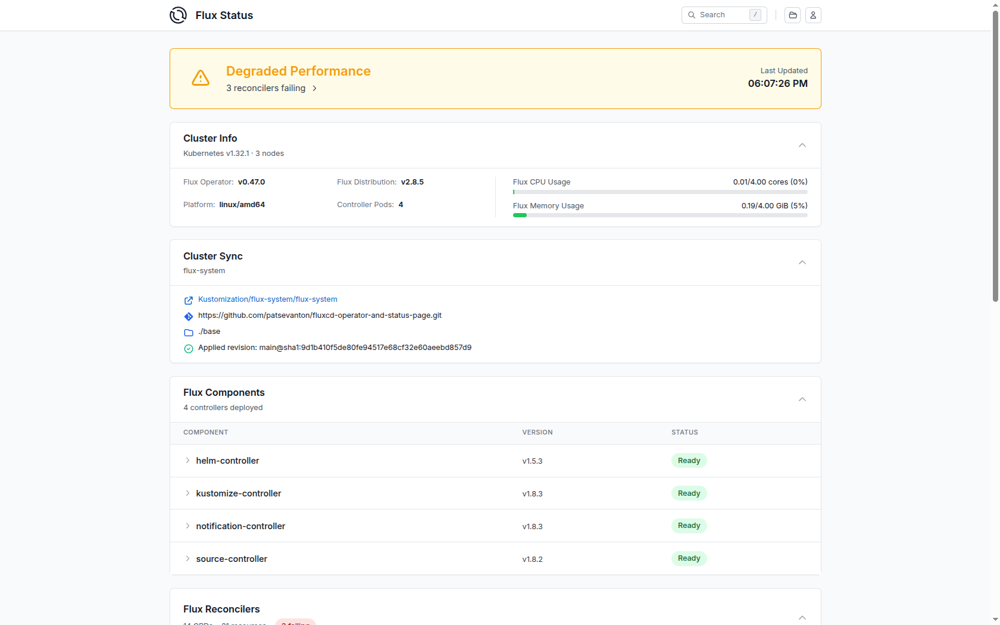
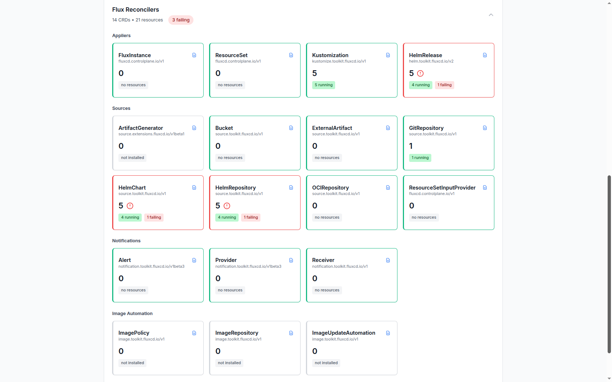
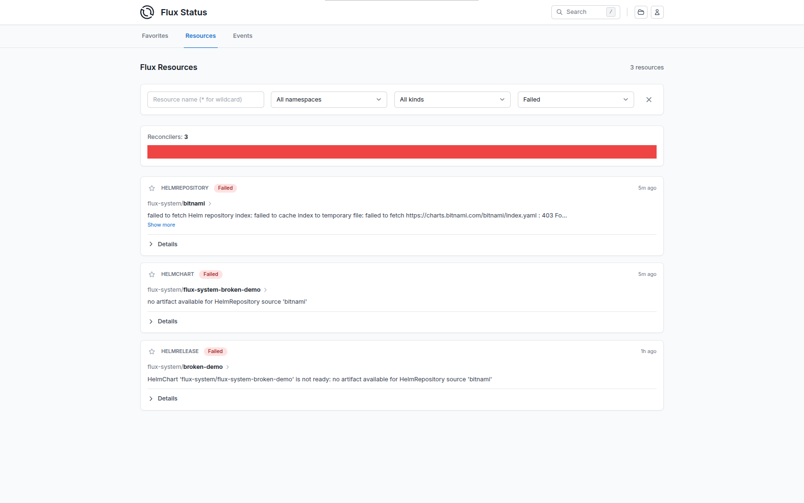
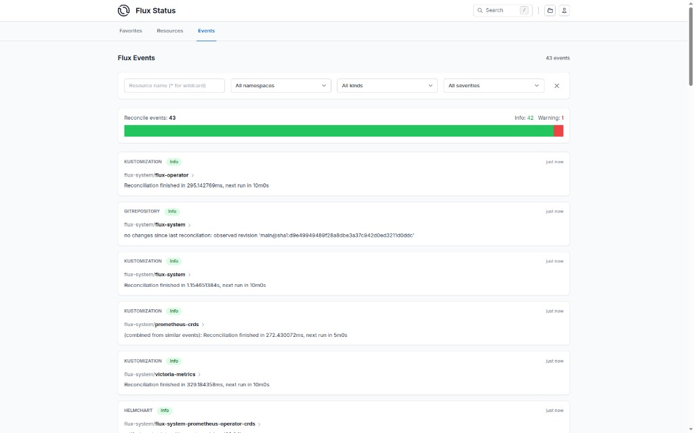

# От Flux CLI к Flux Operator и Status Page: один репозиторий — полный путь

Когда вы впервые поднимаете GitOps в Kubernetes, **Flux CD** кажется достаточным: `flux bootstrap`, манифесты в Git, контроллеры тянут состояние кластера. 

Но лучше перейти на Flux Operator:

- **Декларативный дистрибутив** — версия, реестр образов и состав контроллеров в **FluxInstance** вместо ручного сопровождения манифестов `gotk-components`.
- **Единая синхронизация с Git** — `FluxInstance.spec.sync` вместо разрозненной ручной сборки нескольких объектов.
- **Обновления и откат через Git** — с тем же аудитом и ревью, что и для приложений.
- **Наблюдаемость** — отчёты, метрики и **Status Page**, не только `flux get` в CLI.
- **Привычный GitOps** — `GitRepository`, `Kustomization`, `HelmRelease` остаются; меняется способ **установки и жизненного цикла** самого Flux.

Здесь зафиксирован путь от классического bootstrap к **[Flux Operator](https://fluxoperator.dev/)** (**FluxInstance**) и **FluxCD Status Page**.

## Как устроен репозиторий FluxCD у меня

| Путь | Роль |
|------|------|
| [base/kustomization.yaml](base/kustomization.yaml) | Корневой kustomize: `flux-system` + `flux-resources` + [apps.yaml](base/apps.yaml) |
| [base/apps.yaml](base/apps.yaml) | Flux `Kustomization`: **victoria-metrics**, **prometheus-crds**, **flux-operator** |
| [base/flux-system/](base/flux-system/) | Классический bootstrap: `gotk-components.yaml`, [gotk-sync.yaml](base/flux-system/gotk-sync.yaml). После перехода на оператор каталог лучше оставить только для bootstrap и [flux-instance.yaml](base/flux-system/flux-instance.yaml) |
| `base/flux-resources/` | Пользовательские ресурсы для namespace `flux-system`: `flux-notifications.yaml`, `podmonitor.yaml` |
| [apps/](apps/) | [apps/kustomization.yaml](apps/kustomization.yaml) — локальный `kustomize build apps/` |

**Нюанс раскладки:** при первом `flux bootstrap` CLI по умолчанию кладёт `flux-system/` в корень репозитория. Содержимое `base/` и `apps/` вы коммитите в Git до или после bootstrap — главное, чтобы путь в bootstrap совпадал с тем, что ожидает кластер.


## Часть 1. Классический Flux: bootstrap и приложения

### Предварительные условия

- Чистый кластер Kubernetes.
- **Flux CLI** — [Installing the Flux CLI](https://fluxcd.io/flux/installation/). Проверка: `flux version --client`.
- Доступ к Git-репозиторию для `flux bootstrap`; при необходимости — PAT (см. ниже).

### GitHub Personal Access Token для bootstrap

Для `flux bootstrap github` токен передаётся через `GITHUB_TOKEN` или вводится в интерактиве.


1. [GitHub → Fine-grained tokens](https://github.com/settings/personal-access-tokens/new).
2. **Repository access** — только нужный репозиторий (например `fluxcd-operator-and-status-page`).
3. **Permissions:** **Contents** — Read and write; **Metadata** — Read-only; **Administration** — Read-only.

С флагом `--token-auth` Flux сохраняет PAT в Secret в кластере; для PAT достаточно **Administration → Read-only**.

### Команда bootstrap

```bash
flux bootstrap github \
  --token-auth \
  --owner=patsevanton \
  --repository=fluxcd-operator-and-status-page \
  --branch=main \
  --path=base
```

Фрагмент типичного вывода:

```
Please enter your GitHub personal access token (PAT):
► connecting to github.com
► cloning branch "main" from Git repository "https://github.com/patsevanton/fluxcd-operator-and-status-page.git"
✔ cloned repository
...
✔ all components are healthy
```

flux bootstrap создаст директорию base/flux-system с base/flux-system/gotk-components.yaml и base/flux-system/gotk-components.yaml. Скачайте изменения из Git-репозитория:

```bash
git pull
```

### Проверка после bootstrap

Flux уже синхронизирует ваши приложения. `flux get all -A` показывает состояние всех ресурсов FluxCD.

Команда ниже показывает состояние всех ресурсов FluxCD на которые стоит обратить внимание.
```bash
flux get all -A | grep -v "succeeded" | grep -v Applied | grep -v pulled | grep -v "stored artifact" | grep -v Ready
```

Пример вывода. Видно что broken-demo сломан. broken-demo нужен для тестирования алертов FluxCD.
```
flux get all -A | grep -v "succeeded" | grep -v Applied | grep -v pulled | grep -v "stored artifact" | grep -v Ready
NAMESPACE  	NAME                     	REVISION          	SUSPENDED	READY	MESSAGE                                           

NAMESPACE  	NAME                               	REVISION       	SUSPENDED	READY	MESSAGE                                                                                                                                                       
flux-system	helmrepository/bitnami             	               	False    	False	failed to fetch Helm repository index: failed to cache index to temporary file: failed to fetch https://charts.bitnami.com/bitnami/index.yaml : 403 Forbidden	

NAMESPACE  	NAME                                          	REVISION	SUSPENDED	READY	MESSAGE                                                         
flux-system	helmchart/flux-system-broken-demo             	        	False    	False	no artifact available for HelmRepository source 'bitnami'      	

NAMESPACE  	NAME                                	REVISION	SUSPENDED	READY	MESSAGE                                                                                                                 
flux-system	helmrelease/broken-demo             	        	False    	False	HelmChart 'flux-system/flux-system-broken-demo' is not ready: no artifact available for HelmRepository source 'bitnami'	

NAMESPACE  	NAME                          	REVISION          	SUSPENDED	READY	MESSAGE                              
```

Можно проверить helmreleases kustomizations отдельно.

```
flux get helmreleases -n flux-system
NAME                    	REVISION	SUSPENDED	READY	MESSAGE                                                                                                                 
broken-demo             	        	False    	False	HelmChart 'flux-system/flux-system-broken-demo' is not ready: no artifact available for HelmRepository source 'bitnami'	
prometheus-operator-crds	28.0.1  	False    	True 	Helm install succeeded for release flux-system/prometheus-operator-crds.v1 with chart prometheus-operator-crds@28.0.1  	
vmks                    	0.74.1  	False    	True 	Helm upgrade succeeded for release vmks/vmks.v2 with chart victoria-metrics-k8s-stack@0.74.1 
```

```bash
flux get kustomizations -A
NAMESPACE  	NAME            	REVISION          	SUSPENDED	READY	MESSAGE                              
flux-system	broken-demo     	main@sha1:6f493bf6	False    	True 	Applied revision: main@sha1:6f493bf6	
flux-system	flux-system     	main@sha1:6f493bf6	False    	True 	Applied revision: main@sha1:6f493bf6	
flux-system	prometheus-crds 	main@sha1:6f493bf6	False    	True 	Applied revision: main@sha1:6f493bf6	
flux-system	victoria-metrics	main@sha1:6f493bf6	False    	True 	Applied revision: main@sha1:6f493bf6
```

## Часть 2. Переход на Flux Operator

### Установка Flux Operator

Для установке Flux Operator выполните шаги ниже вручную из корня репозитория.

Создайте файлы из корня репозитория:

```bash
mkdir -p apps/flux-operator

cat <<'EOF' >> base/apps.yaml
---
apiVersion: kustomize.toolkit.fluxcd.io/v1
kind: Kustomization
metadata:
  name: flux-operator
  namespace: flux-system
spec:
  interval: 10m
  sourceRef:
    kind: GitRepository
    name: flux-system
  serviceAccountName: kustomize-controller
  path: ./apps/flux-operator
  prune: true
  wait: true
  timeout: 10m
EOF

cat <<'EOF' > apps/flux-operator/sources.yaml
apiVersion: source.toolkit.fluxcd.io/v1
kind: HelmRepository
metadata:
  name: cp-flux-operator
  namespace: flux-system
spec:
  interval: 24h
  type: oci
  url: oci://ghcr.io/controlplaneio-fluxcd/charts
EOF

cat <<'EOF' > apps/flux-operator/helmrelease.yaml
apiVersion: helm.toolkit.fluxcd.io/v2
kind: HelmRelease
metadata:
  name: flux-operator
  namespace: flux-system
spec:
  interval: 30m
  timeout: 10m
  chart:
    spec:
      chart: flux-operator
      version: "0.47.0"
      sourceRef:
        kind: HelmRepository
        name: cp-flux-operator
        namespace: flux-system
      interval: 30m
  releaseName: flux-operator
  values:
    web:
      enabled: true
      config:
        baseURL: http://flux.apatsev.org.ru/
      ingress:
        enabled: true
        className: nginx
        hosts:
          - host: flux.apatsev.org.ru
            paths:
              - path: /
                pathType: Prefix
EOF
```

Закоммитьте изменения и дождитесь синхронизации:

```bash
git commit -m "Add flux-operator manifests"
flux get kustomizations -n flux-system
flux get helmreleases -n flux-system
```

### Создание FluxInstance

После установки установки Flux Operator `base/flux-system/kustomization.yaml` продолжает ссылаться на `gotk-components.yaml` и `gotk-sync.yaml`, поэтому Flux всё ещё управляется классическим bootstrap.

Лучше всего перейти на `FluxInstance`. FluxInstance описывает для оператора, какую версию Flux развернуть, какие контроллеры включить и с какого Git-репозитория синхронизировать манифесты. После установки оператора это шаг, который фактически поднимает Flux в кластере и привязывает его к вашему GitOps.

Важно про источник управления Flux на этапах миграции:

```bash
mkdir -p base/flux-system

cat <<'EOF' > base/flux-system/flux-instance.yaml
apiVersion: fluxcd.controlplane.io/v1
kind: FluxInstance
metadata:
  name: flux
  namespace: flux-system
spec:
  distribution:
    version: "2.8.x"
    registry: "ghcr.io/fluxcd"
  components:
    - source-controller
    - kustomize-controller
    - helm-controller
    - notification-controller
  sync:
    kind: GitRepository
    url: "https://github.com/patsevanton/fluxcd-operator-and-status-page.git"
    ref: "refs/heads/main"
    path: "./base"
EOF

kubectl apply -f base/flux-system/flux-instance.yaml
```

После создания и применения `base/flux-system/flux-instance.yaml` ресурс `FluxInstance` уже начинает управлять жизненным циклом Flux.

### Проверка миграции

```bash
kubectl -n flux-system get fluxinstance flux
NAME   AGE     READY   STATUS                           REVISION
flux   2m21s   True    Reconciliation finished in 19s   v2.8.5@sha256:df269637e1cbd79f25263d77f754ec782afb780ad197f4732771f661ceb73f3f
```

```bash
kubectl -n flux-system get pods
NAME                                       READY   STATUS    RESTARTS   AGE
flux-operator-64bbc44d7c-v87fj             1/1     Running   0          40m
helm-controller-65ff4c7c98-fvjg9           1/1     Running   0          2m20s
kustomize-controller-59fc467858-mhsbz      1/1     Running   0          2m20s
notification-controller-6d66bb7797-7wp5r   1/1     Running   0          2m20s
source-controller-7846484bbc-6rfg5         1/1     Running   0          2m19s
```

### Очистка репозитория после миграции

Полный переход в Git фиксируется после очистки `gotk-*` и обновления `base/flux-system/kustomization.yaml` на `flux-instance.yaml`.

Удалите артефакты классического bootstrap и переключите `base/flux-system/kustomization.yaml` на один ресурс — `flux-instance.yaml`. Пользовательские манифесты лучше вынести в отдельный `base/flux-resources/`, чтобы их не приходилось пересоздавать, если перед bootstrap вы удаляете `base/flux-system/`.

Подробнее: [Flux Bootstrap Migration](https://fluxcd.control-plane.io/operator/flux-bootstrap-migration).

```bash
git rm base/flux-system/gotk-components.yaml
git rm base/flux-system/gotk-sync.yaml
```

Пересоздайте `base/flux-system/kustomization.yaml`, создайте отдельный `base/flux-resources/` и подключите его в корневой `base/kustomization.yaml`:

```bash
mkdir -p base/flux-resources

cat <<'EOF' > base/flux-system/kustomization.yaml
apiVersion: kustomize.config.k8s.io/v1beta1
kind: Kustomization
resources:
- flux-instance.yaml
EOF

cat <<'EOF' > base/flux-resources/kustomization.yaml
apiVersion: kustomize.config.k8s.io/v1beta1
kind: Kustomization
resources:
- flux-notifications.yaml
- podmonitor.yaml
EOF

cat <<'EOF' > base/kustomization.yaml
apiVersion: kustomize.config.k8s.io/v1beta1
kind: Kustomization
resources:
- flux-system
- flux-resources
- apps.yaml
EOF
```

```bash
git add base/kustomization.yaml base/flux-system/kustomization.yaml base/flux-system/flux-instance.yaml base/flux-resources/kustomization.yaml base/flux-resources/flux-notifications.yaml base/flux-resources/podmonitor.yaml
```

Закоммитьте изменения.

```bash
git commit -m "Moved Flux resources"
```


## FluxCD Status Page

После установки Flux Operator в игру входят **FluxReport**, события по `FluxInstance` и метрики Prometheus.

**Демо-интерфейс:** [http://flux.apatsev.org.ru/](http://flux.apatsev.org.ru/).

### Скриншоты

#### Главная страница — верхний блок (overview)

Сводка состояния Flux компонентов на главной странице.



#### Главная страница — блок Flux Reconcilers

Статусы контроллеров и reconciler-ов Flux.



#### Resources — failed state

Пример экрана с ошибками в ресурсах.



#### Events — список событий Flux

Экран с лентой событий Flux и фильтрами по namespace, kind и severity.



### FluxReport

Ресурс `FluxReport` `flux` в `flux-system` (обновление по умолчанию раз в 5 минут):

```bash
kubectl -n flux-system get fluxreport/flux -o yaml | head -n 20
apiVersion: fluxcd.controlplane.io/v1
kind: FluxReport
metadata:
  annotations:
    reconcile.fluxcd.io/requestedAt: "1776695025"
  creationTimestamp: "2026-04-20T14:12:54Z"
  generation: 5
  name: flux
  namespace: flux-system
  resourceVersion: "15876"
  uid: e4135b2f-95a5-41b7-970f-61273b8a3b46
spec:
  cluster:
    nodes: 3
    platform: linux/amd64
    serverVersion: v1.32.1
  components:
  - image: ghcr.io/fluxcd/helm-controller:v1.5.3@sha256:b150af0cd7a501dafe2374b1d22c39abf0572465df4fa1fb99b37927b0d95d75
    name: helm-controller
    ready: true
```

[Flux Report API](https://fluxoperator.dev/docs/crd/fluxreport).

### События

```bash
kubectl -n flux-system events --for fluxinstance/flux
LAST SEEN   TYPE     REASON                    OBJECT              MESSAGE
3m22s       Normal   Progressing               FluxInstance/flux   Installing revision v2.8.5@sha256:df269637e1cbd79f25263d77f754ec782afb780ad197f4732771f661ceb73f3f
2m33s       Normal   ReconciliationSucceeded   FluxInstance/flux   Flux v2.8.5 installed
CustomResourceDefinition/alerts.notification.toolkit.fluxcd.io configured
CustomResourceDefinition/buckets.source.toolkit.fluxcd.io configured
CustomResourceDefinition/externalartifacts.source.toolkit.fluxcd.io configured
CustomResourceDefinition/gitrepositories.source.toolkit.fluxcd.io configured
CustomResourceDefinition/helmcharts.source.toolkit.fluxcd.io configured
CustomResourceDefinition/helmreleases.helm.toolkit.fluxcd.io configured
CustomResourceDefinition/helmrepositories.source.toolkit.fluxcd.io configured
CustomResourceDefinition/kustomizations.kustomize.toolkit.fluxcd.io configured
CustomResourceDefinition/ocirepositories.source.toolkit.fluxcd.io configured
CustomResourceDefinition/providers.notification.toolkit.fluxcd.io configured
CustomResourceDefinition/receivers.notification.toolkit.fluxcd.io configured
Namespace/flux-system configured
ClusterRole/crd-controller-flux-system configured
ClusterRole/flux-edit-flux-system configured
ClusterRole/flux-view-flux-system configured
ClusterRoleBinding/cluster-reconciler-flux-system configured
ClusterRoleBinding/crd-controller-flux-system configured
ResourceQuota/flux-system/critical-pods-flux-system configured
ServiceAccount/flux-system/helm-controller configured
ServiceAccount/flux-system/kustomize-controller configured
ServiceAccount/flux-system/notification-controller configured
ServiceAccount/flux-system/source-controller configured
Service/flux-system/notification-controller configured
Service/flux-system/source-controller configured
Service/flux-system/webhook-receiver configured
Deployment/flux-system/helm-controller configured
Deployment/flux-system/kustomize-controller configured
Deployment/flux-system/notification-controller configured
Deployment/flux-system/source-controller configured
Kustomization/flux-system/flux-system configured
NetworkPolicy/flux-system/allow-egress configured
NetworkPolicy/flux-system/allow-scraping configured
NetworkPolicy/flux-system/allow-webhooks configured
GitRepository/flux-system/flux-system configured
2m33s       Normal   ReconciliationSucceeded   FluxInstance/flux   Reconciliation finished in 50s
10s         Normal   ReconciliationSucceeded   FluxInstance/flux   Reconciliation finished in 2s
```

Уведомления (Slack, Teams и др.) можно настроить через `notification-controller` и CRD `Provider/Alert`. Подробнее: [Provider/Alert](https://fluxoperator.dev/docs/crd/provider).

### `base/flux-resources/flux-notifications.yaml`: Flux → Alertmanager

Создайте файл `base/flux-resources/flux-notifications.yaml`:

```bash
mkdir -p base/flux-resources

cat <<'EOF' > base/flux-resources/flux-notifications.yaml
# Flux notification-controller → Prometheus Alertmanager (VMAlertmanager из victoria-metrics-k8s-stack).
# События с severity error попадают в Alertmanager; Grafana их видит через datasource Alertmanager.
---
apiVersion: notification.toolkit.fluxcd.io/v1beta3
kind: Provider
metadata:
  name: alertmanager
  namespace: flux-system
spec:
  type: alertmanager
  # VMAlertmanager CR: vmks-victoria-metrics-k8s-stack (release vmks, chart victoria-metrics-k8s-stack), ns vmks
  address: http://vmalertmanager-vmks-victoria-metrics-k8s-stack.vmks.svc.cluster.local:9093/api/v2/alerts
---
apiVersion: notification.toolkit.fluxcd.io/v1beta3
kind: Alert
metadata:
  name: flux-to-alertmanager
  namespace: flux-system
spec:
  providerRef:
    name: alertmanager
  eventSeverity: error
  eventSources:
    - kind: GitRepository
      name: "*"
    - kind: OCIRepository
      name: "*"
    - kind: HelmRepository
      name: "*"
    - kind: HelmChart
      name: "*"
    - kind: HelmRelease
      name: "*"
    - kind: Kustomization
      name: "*"
EOF
```

Файл подключается через `base/flux-resources/kustomization.yaml` и создаёт в `flux-system`:

- **`Provider`** `alertmanager` — тип `alertmanager`, адрес HTTP API VMAlertmanager из [VictoriaMetrics K8s Stack](https://github.com/VictoriaMetrics/helm-charts/tree/master/charts/victoria-metrics-k8s-stack) (в манифесте задан сервис релиза `vmks-victoria-metrics-k8s-stack` в namespace `vmks`).
- **`Alert`** `flux-to-alertmanager` — события с **severity `error`** от перечисленных источников (`GitRepository`, `OCIRepository`, `HelmRepository`, `HelmChart`, `HelmRelease`, `Kustomization`) отправляются в этот провайдер.

Нужны работающие **notification-controller** (в [FluxInstance](base/flux-system/flux-instance.yaml) он в `spec.components`) и **VMAlertmanager** по адресу из `Provider.spec.address`, иначе доставка алертов не состоится.

#### Проверка, что манифест применился

Убедитесь, что корневая синхронизация подтянула ревизию с этим файлом:

```bash
flux get kustomizations -n flux-system flux-system
```

Должны существовать объекты `Provider` и `Alert`:

```bash
kubectl get providers.notification.toolkit.fluxcd.io -n flux-system
kubectl get alerts.notification.toolkit.fluxcd.io -n flux-system
```

Ожидаемые имена: `alertmanager` и `flux-to-alertmanager`. Детали и статус:

```bash
kubectl -n flux-system get provider alertmanager -o yaml
kubectl -n flux-system get alert flux-to-alertmanager -o yaml
```

При необходимости проверьте, что объект попадает в сборку kustomize (локально из корня репозитория):

```bash
kubectl kustomize base/flux-resources | grep -E 'kind: (Provider|Alert)|name: (alertmanager|flux-to-alertmanager)'
```

#### Проверка, что CRD notification API установлены

CRD ставит дистрибутив Flux (оператор / `FluxInstance`), а не сам файл `base/flux-resources/flux-notifications.yaml`. Убедитесь, что в кластере есть группа `notification.toolkit.fluxcd.io`:

```bash
kubectl api-resources --api-group=notification.toolkit.fluxcd.io
```

Должны быть как минимум ресурсы вроде `providers`, `alerts`, `receivers` (точный набор зависит от версии Flux).

Явная проверка CRD для `Provider` и `Alert`:

```bash
kubectl get crd providers.notification.toolkit.fluxcd.io
kubectl get crd alerts.notification.toolkit.fluxcd.io
```

Если команды возвращают `NotFound`, контроллер уведомлений или установка Flux не завершена — смотрите `FluxInstance` и поды `notification-controller` в `flux-system`.

### Метрики

Создайте файл `base/flux-resources/podmonitor.yaml` для сбора метрик:

```bash
mkdir -p base/flux-resources

cat <<'EOF' > base/flux-resources/podmonitor.yaml
apiVersion: monitoring.coreos.com/v1
kind: PodMonitor
metadata:
  name: flux-system
  labels:
    app.kubernetes.io/part-of: flux
    app.kubernetes.io/component: monitoring
spec:
  namespaceSelector:
    matchNames:
      - flux-system
  selector:
    matchExpressions:
      - key: app
        operator: In
        values:
          - helm-controller
          - source-controller
          - kustomize-controller
          - notification-controller
          - image-automation-controller
          - image-reflector-controller
  podMetricsEndpoints:
    - port: http-prom
EOF
```

Для Prometheus Operator: `serviceMonitor.create=true` в `values`. Подробнее: [Flux Monitoring and Reporting](https://fluxcd.control-plane.io/operator/monitoring).

## Устранение неполадок

| Симптом | Что проверить |
|---------|----------------|
| `GitRepository` / `Kustomization` не Ready | `flux get sources git -A`, `kubectl describe gitrepository -n flux-system`, сеть и права PAT / deploy key |
| HelmRelease завис | `flux get helmreleases -A`, логи `helm-controller`, значения в `HelmRelease` |
| После миграции не применяется `base/` | В `FluxInstance.spec.sync.path` должно быть `./base`, если манифесты лежат под `base/` |
| Нет метрик оператора | Service `flux-operator`, порт 8080; при необходимости `ServiceMonitor` |


## Метрики и Grafana

[VictoriaMetrics K8s Stack](https://github.com/VictoriaMetrics/helm-charts/tree/master/charts/victoria-metrics-k8s-stack) поднимает **Grafana** вместе с vmagent, VMSingle и правилами алертинга.

**Веб-доступ:** в этом репозитории для Grafana включён Ingress — [https://grafana.apatsev.org.ru](https://grafana.apatsev.org.ru) (см. [apps/victoria-metrics/helmrelease.yaml](apps/victoria-metrics/helmrelease.yaml)).

Пароль администратора Grafana:

```bash
kubectl get secret vmks-grafana -n vmks -o jsonpath='{.data.admin-password}' | base64 --decode; echo
```

### Установка FluxCD dashboard в Grafana

Готовые дашборды FluxCD можно добавить в Grafana двумя способами:

- Через UI Grafana: **Dashboards → Import** и импорт JSON из [flux2-monitoring-example](https://github.com/fluxcd/flux2-monitoring-example/tree/main/monitoring/configs/dashboards).
- Через [Grafana Dashboard ID 16714 (Flux2)](https://grafana.com/grafana/dashboards/16714-flux2/).

Если метрики Flux уже собираются (через `ServiceMonitor`), дашборды начнут показывать данные сразу после импорта.
