# От Flux CLI к Flux Operator и Status Page: один репозиторий — полный путь

**[Flux CD](https://fluxcd.io/)** — это набор инструментов для GitOps в Kubernetes. Он следит за Git-репозиторием и автоматически приводит состояние кластера в соответствие с описанными в нём манифестами и Helm-чартами. Flux работает как контроллер внутри кластера: подтягивает изменения из Git, применяет их через Kubernetes API и отслеживает статус каждого ресурса. Проект является graduated-проектом CNCF.

Когда вы впервые поднимаете GitOps в Kubernetes, **Flux CD** кажется достаточным: `flux bootstrap`, манифесты в Git, контроллеры тянут состояние кластера.

Но лучше перейти на Flux Operator:

- **Декларативный дистрибутив** — версия, реестр образов и состав контроллеров в **FluxInstance** вместо ручного сопровождения манифестов `gotk-components`.
- **Единая синхронизация с Git** — `FluxInstance.spec.sync` вместо разрозненной ручной сборки нескольких объектов.
- **Обновления и откат через Git** — с тем же аудитом и ревью, что и для приложений.
- **Наблюдаемость** — отчёты, метрики и **Status Page**, не только `flux get` в CLI.
- **Привычный GitOps** — `GitRepository`, `Kustomization`, `HelmRelease` остаются; меняется способ **установки и жизненного цикла** самого Flux.

Здесь зафиксирован путь от классического bootstrap к **[Flux Operator](https://fluxoperator.dev/)** (**FluxInstance**) и **FluxCD Status Page**.

## Часть 1. Классический Flux: bootstrap и приложения

### Предварительные условия

- Чистый кластер Kubernetes.
- **Flux CLI** — [Installing the Flux CLI](https://fluxcd.io/flux/installation/). Проверка: `flux version --client`.
- Доступ к Git-репозиторию для `flux bootstrap`; при необходимости — PAT (см. ниже).

### GitHub Personal Access Token для bootstrap

Для `flux bootstrap github` токен передаётся через `GITHUB_TOKEN` или вводится в интерактиве.

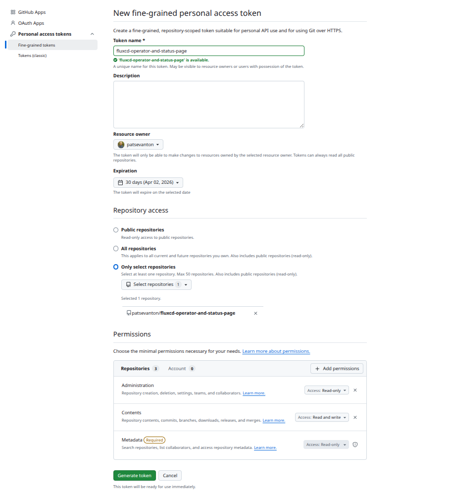

1. [GitHub → Fine-grained tokens](https://github.com/settings/personal-access-tokens/new).
2. **Repository access** — только нужный репозиторий (например `fluxcd-operator-and-status-page`).
3. **Permissions:** **Contents** — Read and write; **Metadata** — Read-only; **Administration** — Read-only.

С флагом `--token-auth` Flux сохраняет PAT в Secret в кластере; для PAT достаточно **Administration → Read-only**.

### Команда bootstrap

Запустите bootstrap из любой машины с установленным Flux CLI и доступом к кластеру. Команда создаст в репозитории директорию `base/flux-system/` с манифестами контроллеров (`gotk-components.yaml`) и синхронизации (`gotk-sync.yaml`), а также закоммитит их в ветку `main`.

```bash
flux bootstrap github \
  --token-auth \
  --owner=patsevanton \
  --repository=fluxcd-operator-and-status-page \
  --branch=main \
  --path=base
```

Фрагмент типичного вывода:

```
Please enter your GitHub personal access token (PAT):
► connecting to github.com
► cloning branch "main" from Git repository "https://github.com/patsevanton/fluxcd-operator-and-status-page.git"
✔ cloned repository
...
✔ all components are healthy
```

После bootstrap обновите локальную копию репозитория, чтобы подтянуть созданные файлы:

```bash
git pull
```

### Проверка после bootstrap

Flux уже синхронизирует ваши приложения. Показать состояние всех ресурсов FluxCD:

```bash
flux get all -A
```

Команда ниже фильтрует вывод, оставляя только ресурсы с проблемами. Видно, что `broken-demo` сломан — он нужен для тестирования алертов FluxCD:

```bash
flux get all -A | grep -v "succeeded" | grep -v Applied | grep -v pulled | grep -v "stored artifact" | grep -v Ready
NAMESPACE  	NAME                     	REVISION          	SUSPENDED	READY	MESSAGE                                           

NAMESPACE  	NAME                               	REVISION       	SUSPENDED	READY	MESSAGE                                     

NAMESPACE  	NAME                                          	REVISION	SUSPENDED	READY	MESSAGE                                                         

NAMESPACE  	NAME                                	REVISION	SUSPENDED	READY	MESSAGE                                                                                                               

NAMESPACE  	NAME                          	REVISION          	SUSPENDED	READY	MESSAGE                                                                                                                                                                                                                                                                                                                                                                                                                 
flux-system	kustomization/broken-demo     	                  	False    	False	HelmRelease/broken-demo/broken-demo dry-run failed (Invalid): HelmRelease.helm.toolkit.fluxcd.io "broken-demo" is invalid: [spec.chart.spec.sourceRef.kind: Unsupported value: "OCIRepository": supported values: "HelmRepository", "GitRepository", "Bucket", <nil>: Invalid value: "null": some validation rules were not checked because the object was invalid; correct the existing errors to complete validation]	
          	                              	                  	         	     	Namespace/broken-demo created                      
```

Проверить HelmReleases отдельно:

```bash
flux get helmreleases -n flux-system
NAME                    	REVISION	SUSPENDED	READY	MESSAGE                                                                                                               
prometheus-operator-crds	28.0.1  	False    	True 	Helm install succeeded for release flux-system/prometheus-operator-crds.v1 with chart prometheus-operator-crds@28.0.1
vmks                    	0.74.1  	False    	True 	Helm upgrade succeeded for release vmks/vmks.v2 with chart victoria-metrics-k8s-stack@0.74.1  
```

Проверить Kustomization'ы:

```bash
flux get kustomizations -A
NAMESPACE  	NAME            	REVISION          	SUSPENDED	READY	MESSAGE                                                                                                                                       
flux-system	broken-demo     	                  	False    	False	HelmRelease/broken-demo/broken-demo dry-run failed (Invalid): HelmRelease.helm.toolkit.fluxcd.io "broken-demo" is invalid: [spec.chart.spec.sourceRef.kind: Unsupported value: "OCIRepository": supported values: "HelmRepository", "GitRepository", "Bucket", <nil>: Invalid value: "null": some validation rules were not checked because the object was invalid; correct the existing errors to complete validation]	
                                                                           	
flux-system	flux-system     	main@sha1:05119ed0	False    	True 	Applied revision: main@sha1:05119ed0                                                                                                               

flux-system	prometheus-crds 	main@sha1:05119ed0	False    	True 	Applied revision: main@sha1:05119ed0                                                                                                               

flux-system	victoria-metrics	main@sha1:05119ed0	False    	True 	Applied revision: main@sha1:05119ed0    
```

## Часть 2. Переход на Flux Operator

### Установка Flux Operator

Для установки Flux Operator выполните шаги ниже вручную из корня репозитория.

Создайте директорию для манифестов оператора:

```bash
mkdir -p apps/flux-operator
```

Добавьте Kustomization для `flux-operator` в конец файла `base/apps.yaml` (существующие записи `victoria-metrics`, `broken-demo`, `prometheus-crds` останутся на месте):

```bash
cat <<'EOF' >> base/apps.yaml
---
apiVersion: kustomize.toolkit.fluxcd.io/v1
kind: Kustomization
metadata:
  name: flux-operator
  namespace: flux-system
spec:
  interval: 10m
  sourceRef:
    kind: GitRepository
    name: flux-system
  serviceAccountName: kustomize-controller
  path: ./apps/flux-operator
  prune: true
  wait: true
  timeout: 10m
EOF
```

Создайте HelmRepository для OCI-чарта ControlPlane:

```bash
cat <<'EOF' > apps/flux-operator/sources.yaml
apiVersion: source.toolkit.fluxcd.io/v1
kind: HelmRepository
metadata:
  name: cp-flux-operator
  namespace: flux-system
spec:
  interval: 24h
  type: oci
  url: oci://ghcr.io/controlplaneio-fluxcd/charts
EOF
```

Создайте HelmRelease оператора. Обратите внимание на секцию `web` — она включает Status Page и настраивает Ingress:

```bash
cat <<'EOF' > apps/flux-operator/helmrelease.yaml
apiVersion: helm.toolkit.fluxcd.io/v2
kind: HelmRelease
metadata:
  name: flux-operator
  namespace: flux-system
spec:
  interval: 30m
  timeout: 10m
  chart:
    spec:
      chart: flux-operator
      version: "0.47.0"
      sourceRef:
        kind: HelmRepository
        name: cp-flux-operator
        namespace: flux-system
      interval: 30m
  releaseName: flux-operator
  values:
    web:
      enabled: true
      config:
        baseURL: http://flux.apatsev.org.ru/
      ingress:
        enabled: true
        className: nginx
        hosts:
          - host: flux.apatsev.org.ru
            paths:
              - path: /
                pathType: Prefix
EOF
```

Закоммитьте изменения и отправьте в удалённый репозиторий:

```bash
git add .
git commit -m "Add flux-operator manifests"
git push
```

Дождитесь, пока Flux синхронизирует новую Kustomization и установит оператор:

```bash
flux get kustomizations -n flux-system | grep flux-operator
flux-operator   	main@sha1:e23386ea	False    	True 	Applied revision: main@sha1:e23386ea
```

Проверить, что HelmRelease оператора установлен:

```bash
flux get helmreleases -n flux-system | grep flux-operator
flux-operator           	0.47.0  	False    	True 	Helm install succeeded for release flux-system/flux-operator.v1 with chart flux-operator@0.47.0                 
```

### Создание FluxInstance

После установки Flux Operator файл `base/flux-system/kustomization.yaml` (созданный `flux bootstrap`) продолжает ссылаться на `gotk-components.yaml` и `gotk-sync.yaml`, поэтому Flux всё ещё управляется классическим bootstrap.

Чтобы перейти на управление через оператор, создайте `FluxInstance`. Этот ресурс описывает оператору, какую версию Flux развернуть, какие контроллеры включить и с какого Git-репозитория синхронизировать манифесты.

**Важно понимать порядок переключения:** сначала создаётся `FluxInstance`, оператор берёт управление Flux на себя, и только затем удаляются старые файлы bootstrap. Попытка удалить `gotk-*` до создания `FluxInstance` приведёт к потере управления кластером.

Создайте файл FluxInstance:

```bash
mkdir -p base/flux-system

cat <<'EOF' > base/flux-system/flux-instance.yaml
apiVersion: fluxcd.controlplane.io/v1
kind: FluxInstance
metadata:
  name: flux
  namespace: flux-system
spec:
  distribution:
    version: "2.8.x"
    registry: "ghcr.io/fluxcd"
  components:
    - source-controller
    - kustomize-controller
    - helm-controller
    - notification-controller
  sync:
    kind: GitRepository
    url: "https://github.com/patsevanton/fluxcd-operator-and-status-page.git"
    ref: "refs/heads/main"
    path: "./base"
EOF
```

Примените FluxInstance напрямую через kubectl, чтобы оператор сразу начал управлять Flux:

```bash
kubectl apply -f base/flux-system/flux-instance.yaml
```

После применения `FluxInstance` оператор начинает управлять жизненным циклом Flux: создаёт контроллеры, настраивает синхронизацию и выпускает `FluxReport`.

### Проверка миграции

Проверить статус FluxInstance:

```bash
kubectl -n flux-system get fluxinstance flux
NAME   AGE     READY   STATUS                           REVISION
flux   2m21s   True    Reconciliation finished in 19s   v2.8.5@sha256:df269637e1cbd79f25263d77f754ec782afb780ad197f4732771f661ceb73f3f
```

Убедиться, что контроллеры запущены (включая оператор):

```bash
kubectl -n flux-system get pods
NAME                                       READY   STATUS    RESTARTS   AGE
flux-operator-64bbc44d7c-v87fj             1/1     Running   0          40m
helm-controller-65ff4c7c98-fvjg9           1/1     Running   0          2m20s
kustomize-controller-59fc467858-mhsbz      1/1     Running   0          2m20s
notification-controller-6d66bb7797-7wp5r   1/1     Running   0          2m20s
source-controller-7846484bbc-6rfg5         1/1     Running   0          2m19s
```

### Очистка репозитория после миграции

Полный переход на Flux Operator фиксируется удалением файлов классического bootstrap и обновлением `base/flux-system/kustomization.yaml` так, чтобы он ссылался только на `flux-instance.yaml`.

Подробнее: [Flux Bootstrap Migration](https://fluxcd.control-plane.io/operator/flux-bootstrap-migration).

Удалите артефакты классического bootstrap:

```bash
rm base/flux-system/gotk-components.yaml
rm base/flux-system/gotk-sync.yaml
```

Пересоздайте `base/flux-system/kustomization.yaml`, чтобы он включал только `flux-instance.yaml`:

```bash
cat <<'EOF' > base/flux-system/kustomization.yaml
apiVersion: kustomize.config.k8s.io/v1beta1
kind: Kustomization
resources:
- flux-instance.yaml
EOF
```

Добавьте все изменения в индекс:

```bash
git add .
```

Закоммитьте и отправьте в удалённый репозиторий:

```bash
git commit -m "Moved Flux resources"
git push
```


## Часть 3. FluxCD Status Page

После установки Flux Operator в игру входят **FluxReport**, события по `FluxInstance` и метрики Prometheus.

**Демо-интерфейс:** [http://flux.apatsev.org.ru/](http://flux.apatsev.org.ru/).

### Скриншоты

#### Главная страница — верхний блок (overview)

Сводка состояния Flux компонентов на главной странице.

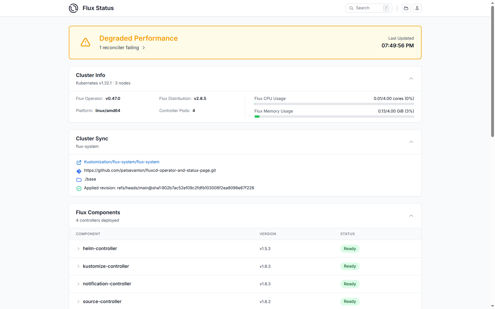

#### Главная страница — блок Flux Reconcilers

Статусы контроллеров и reconciler-ов Flux.

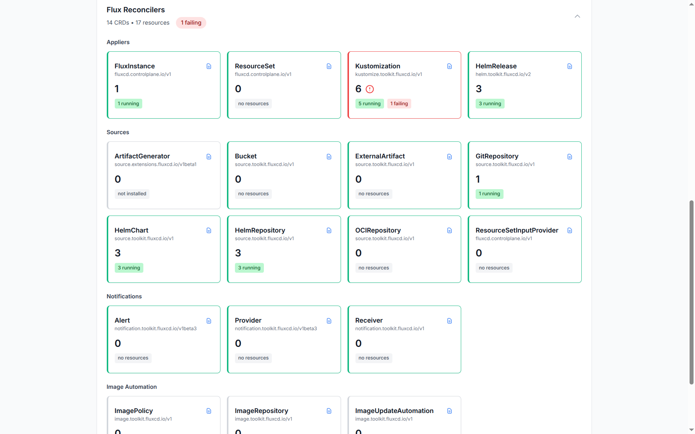

#### Resources — failed state

Пример экрана с ошибками в ресурсах.

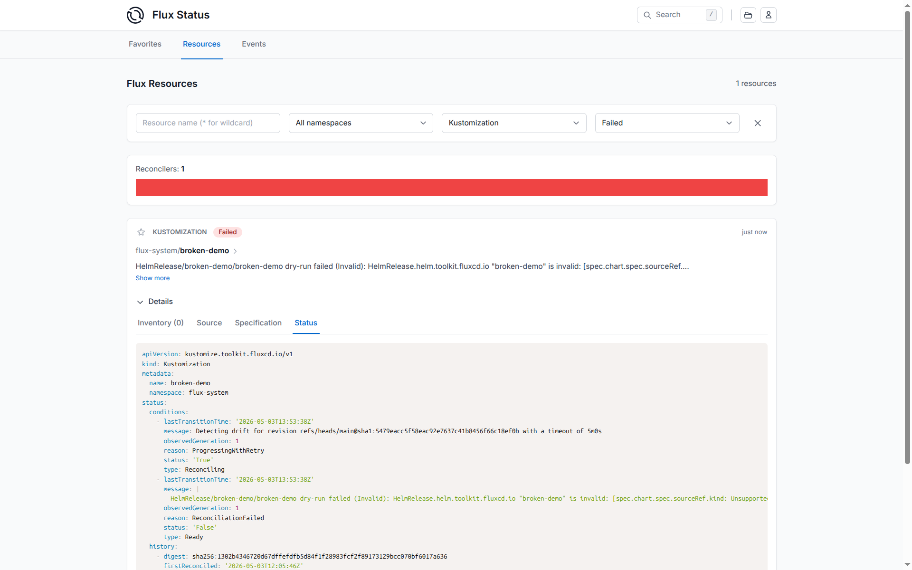

#### Events — список событий Flux

Экран с лентой событий Flux и фильтрами по namespace, kind и severity.

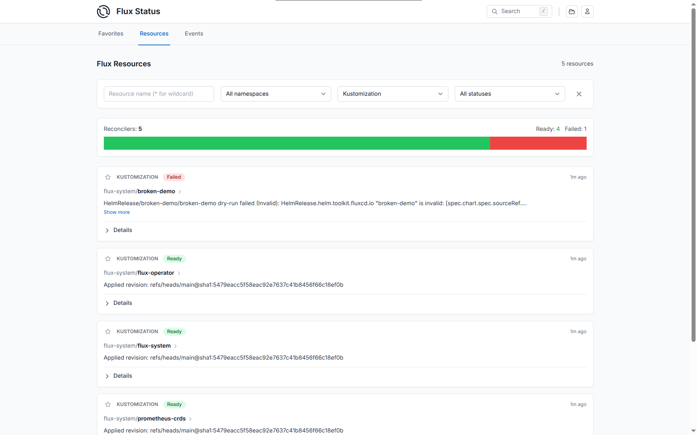

### FluxReport

Ресурс `FluxReport` `flux` в `flux-system` (обновление по умолчанию раз в 5 минут):

```bash
kubectl -n flux-system get fluxreport flux -o yaml
```

Пример вывода (фрагмент):

```yaml
apiVersion: fluxcd.controlplane.io/v1
kind: FluxReport
metadata:
  annotations:
    reconcile.fluxcd.io/requestedAt: "1777814067"
  creationTimestamp: "2026-05-03T12:18:48Z"
  generation: 7
  name: flux
  namespace: flux-system
  resourceVersion: "46482"
  uid: fe113d16-e144-433b-a666-53a94a042b5c
spec:
  cluster:
    nodes: 3
    platform: linux/amd64
    serverVersion: v1.32.1
  components:
  - image: ghcr.io/fluxcd/helm-controller:v1.5.3@sha256:b150af0cd7a501dafe2374b1d22c39abf0572465df4fa1fb99b37927b0d95d75
    name: helm-controller
    ready: true
```

[Flux Report API](https://fluxoperator.dev/docs/crd/fluxreport).

### События

Посмотреть события, связанные с FluxInstance:

```bash
kubectl -n flux-system get events --for fluxinstance/flux
LAST SEEN   TYPE     REASON                    OBJECT              MESSAGE
43m         Normal   ReconciliationSucceeded   FluxInstance/flux   Reconciliation finished in 2s
```

Уведомления (Slack, Teams и др.) можно настроить через `notification-controller` и CRD `Provider/Alert`. Подробнее: [Provider/Alert](https://fluxoperator.dev/docs/crd/provider).

### Уведомления Flux в Alertmanager

Создайте директорию для ресурсов Flux:

```bash
mkdir -p apps/flux-resources
```

Создайте файл с Provider и Alert для пересылки событий Flux в Alertmanager:

```bash
cat <<'EOF' > apps/flux-resources/flux-notifications.yaml
# Flux notification-controller → Prometheus Alertmanager (VMAlertmanager из victoria-metrics-k8s-stack).
# События с severity error попадают в Alertmanager; Grafana их видит через datasource Alertmanager.
---
apiVersion: notification.toolkit.fluxcd.io/v1beta3
kind: Provider
metadata:
  name: alertmanager
  namespace: flux-system
spec:
  type: alertmanager
  # VMAlertmanager CR: vmks-victoria-metrics-k8s-stack (release vmks, chart victoria-metrics-k8s-stack), ns vmks
  address: http://vmalertmanager-vmks-victoria-metrics-k8s-stack.vmks.svc.cluster.local:9093/api/v2/alerts
---
apiVersion: notification.toolkit.fluxcd.io/v1beta3
kind: Alert
metadata:
  name: flux-to-alertmanager
  namespace: flux-system
spec:
  providerRef:
    name: alertmanager
  eventSeverity: error
  eventSources:
    - kind: GitRepository
      name: "*"
    - kind: OCIRepository
      name: "*"
    - kind: HelmRepository
      name: "*"
    - kind: HelmChart
      name: "*"
    - kind: HelmRelease
      name: "*"
    - kind: Kustomization
      name: "*"
EOF
```

Добавьте Kustomization для `flux-resources` в `base/apps.yaml`:

```bash
cat <<'EOF' >> base/apps.yaml
---
apiVersion: kustomize.toolkit.fluxcd.io/v1
kind: Kustomization
metadata:
  name: flux-resources
  namespace: flux-system
spec:
  interval: 10m
  sourceRef:
    kind: GitRepository
    name: flux-system
  serviceAccountName: kustomize-controller
  path: ./apps/flux-resources
  prune: true
  wait: true
  timeout: 5m
EOF
```

Создайте `kustomization.yaml` для явного перечисления ресурсов в директории:

```bash
cat <<'EOF' > apps/flux-resources/kustomization.yaml
apiVersion: kustomize.config.k8s.io/v1beta1
kind: Kustomization
resources:
- flux-notifications.yaml
EOF
```

Закоммитьте изменения и отправьте в удалённый репозиторий:

```bash
git add .
git commit -m "Add Flux Alertmanager notifications"
git push
```

Манифест создаёт в `flux-system`:

- **`Provider`** `alertmanager` — тип `alertmanager`, адрес HTTP API VMAlertmanager из [VictoriaMetrics K8s Stack](https://github.com/VictoriaMetrics/helm-charts/tree/master/charts/victoria-metrics-k8s-stack) (в манифесте задан сервис релиза `vmks-victoria-metrics-k8s-stack` в namespace `vmks`).
- **`Alert`** `flux-to-alertmanager` — события с **severity `error`** от перечисленных источников (`GitRepository`, `OCIRepository`, `HelmRepository`, `HelmChart`, `HelmRelease`, `Kustomization`) отправляются в этот провайдер.

Нужны работающие **notification-controller** (в [FluxInstance](base/flux-system/flux-instance.yaml) он в `spec.components`) и **VMAlertmanager** по адресу из `Provider.spec.address`, иначе доставка алертов не состоится.

#### Проверка, что манифест применился

Убедитесь, что корневая синхронизация подтянула ревизию с этим файлом:

```bash
flux get kustomizations -n flux-system flux-system
```

Проверить, что объект `Provider` создан:

```bash
kubectl get providers.notification.toolkit.fluxcd.io -n flux-system
NAME           AGE
alertmanager   23s
```

Проверить, что объект `Alert` создан:

```bash
kubectl get alerts.notification.toolkit.fluxcd.io -n flux-system
NAME                   AGE
flux-to-alertmanager   29s
```

Детали и статус объекта `Provider`:

```bash
kubectl -n flux-system get provider alertmanager -o yaml
apiVersion: notification.toolkit.fluxcd.io/v1beta3
kind: Provider
metadata:
  creationTimestamp: "2026-05-03T14:09:46Z"
  finalizers:
  - finalizers.fluxcd.io
  generation: 1
  labels:
    kustomize.toolkit.fluxcd.io/name: flux-resources
    kustomize.toolkit.fluxcd.io/namespace: flux-system
  name: alertmanager
  namespace: flux-system
  resourceVersion: "52687"
  uid: 311becb0-ea11-454f-859b-0f76585bbbc0
spec:
  address: http://vmalertmanager-vmks-victoria-metrics-k8s-stack.vmks.svc.cluster.local:9093/api/v2/alerts
  type: alertmanager
```

Детали и статус объекта `Alert`:

```bash
kubectl -n flux-system get alert flux-to-alertmanager -o yaml
apiVersion: notification.toolkit.fluxcd.io/v1beta3
kind: Alert
metadata:
  creationTimestamp: "2026-05-03T14:09:46Z"
  generation: 1
  labels:
    kustomize.toolkit.fluxcd.io/name: flux-resources
    kustomize.toolkit.fluxcd.io/namespace: flux-system
  name: flux-to-alertmanager
  namespace: flux-system
  resourceVersion: "52685"
  uid: c49e6233-63f0-499e-8293-db2be1838c5f
spec:
  eventSeverity: error
  eventSources:
  - kind: GitRepository
    name: '*'
  - kind: OCIRepository
    name: '*'
  - kind: HelmRepository
    name: '*'
  - kind: HelmChart
    name: '*'
  - kind: HelmRelease
    name: '*'
  - kind: Kustomization
    name: '*'
  providerRef:
    name: alertmanager
```

Локально проверить, что объекты попадают в сборку kustomize:

```bash
kubectl kustomize apps/flux-resources | grep -E 'kind: (Provider|Alert)|name: (alertmanager|flux-to-alertmanager)'
kind: Alert
  name: flux-to-alertmanager
    name: alertmanager
kind: Provider
  name: alertmanager
```

### Метрики

Контроллеры Flux экспонируют Prometheus-совместимые метрики на порту `http-prom` — счётчики и гистограммы реконсиляций, задержек обработки артефактов, очередей и ошибок. Без сбора этих метрик невозможно:

- визуализировать здоровье контроллеров и длину очередей реконсиляции в Grafana,
- строить алерты на рост длительности реконсиляции или частоту ошибок (см. Alertmanager выше),
- отслеживать тренды использования ресурсов и планировать масштабирование.

**PodMonitor** — ресурс Prometheus Operator (CRD `monitoring.coreos.com/v1`), который говорит vmagent / Prometheus, какие поды скрейпить и на каком порту. В отличие от ServiceMonitor, PodMonitor выбирает поды напрямую по лейблам — удобно, когда у контроллеров нет отдельного Service с нужными портами.

Создайте PodMonitor для сбора метрик со всех Flux-контроллеров:

```bash
cat <<'EOF' > apps/flux-resources/podmonitor.yaml
apiVersion: monitoring.coreos.com/v1
kind: PodMonitor
metadata:
  name: flux-system
  namespace: flux-system
  labels:
    app.kubernetes.io/part-of: flux
    app.kubernetes.io/component: monitoring
spec:
  namespaceSelector:
    matchNames:
      - flux-system
  selector:
    matchExpressions:
      - key: app
        operator: In
        values:
          - helm-controller
          - source-controller
          - kustomize-controller
          - notification-controller
          - image-automation-controller
          - image-reflector-controller
  podMetricsEndpoints:
    - port: http-prom
EOF
```

Обновите `apps/flux-resources/kustomization.yaml`, чтобы подключить оба ресурса:

```bash
cat <<'EOF' > apps/flux-resources/kustomization.yaml
apiVersion: kustomize.config.k8s.io/v1beta1
kind: Kustomization
resources:
- flux-notifications.yaml
- podmonitor.yaml
EOF
```

Закоммитьте изменения и отправьте в удалённый репозиторий:

```bash
git add .
git commit -m "Added PodMonitor for Flux"
git push
```

#### Проверка PodMonitor и метрик

Убедитесь, что Kustomization `flux-resources` подтянула ревизию с `podmonitor.yaml`:

```bash
flux get kustomizations -n flux-system flux-resources
NAME          	REVISION                     	SUSPENDED	READY	MESSAGE                                         
flux-resources	refs/heads/main@sha1:429293c9	False    	True 	Applied revision: refs/heads/main@sha1:429293c9	
```

Посмотреть события Kustomization (в стандартном `flux` нет подкоманды `describe`):

```bash
kubectl get events -n flux-system --field-selector involvedObject.name=flux-resources --sort-by='.lastTimestamp'
LAST SEEN   TYPE     REASON                    OBJECT                         MESSAGE
5m46s       Normal   Progressing               kustomization/flux-resources   Alert/flux-system/flux-to-alertmanager created...
5m46s       Normal   Progressing               kustomization/flux-resources   Health check passed in 32.876003ms
5m46s       Normal   ReconciliationSucceeded   kustomization/flux-resources   Reconciliation finished in 204.558291ms, next run in 10m0s
101s        Normal   ReconciliationSucceeded   kustomization/flux-resources   Reconciliation finished in 241.056785ms, next run in 10m0s
38s         Normal   Progressing               kustomization/flux-resources   PodMonitor/flux-system/flux-system created
38s         Normal   Progressing               kustomization/flux-resources   Health check passed in 100.046212ms
37s         Normal   ReconciliationSucceeded   kustomization/flux-resources   Reconciliation finished in 334.747203ms, next run in 10m0s
```

Проверить объект PodMonitor в кластере. Ресурс должен быть в namespace `flux-system` — без `metadata.namespace` Flux при применении выдаст ошибку `PodMonitor/... namespace not specified`:

```bash
kubectl get podmonitor -n flux-system
NAME          AGE
flux-system   84s
```

Детали объекта:

```bash
kubectl describe podmonitor flux-system -n flux-system
Name:         flux-system
Namespace:    flux-system
Labels:       app.kubernetes.io/component=monitoring
              app.kubernetes.io/part-of=flux
              kustomize.toolkit.fluxcd.io/name=flux-resources
              kustomize.toolkit.fluxcd.io/namespace=flux-system
Annotations:  <none>
API Version:  monitoring.coreos.com/v1
Kind:         PodMonitor
Metadata:
  Creation Timestamp:  2026-05-03T14:14:54Z
  Generation:          1
  Resource Version:    54801
  UID:                 601a63ec-4b61-4349-9096-ffc38fdc7b33
Spec:
  Namespace Selector:
    Match Names:
      flux-system
  Pod Metrics Endpoints:
    Port:  http-prom
  Selector:
    Match Expressions:
      Key:       app
      Operator:  In
      Values:
        helm-controller
        source-controller
        kustomize-controller
        notification-controller
        image-automation-controller
        image-reflector-controller
Events:  <none>
```

Локально проверить, что PodMonitor попадает в сборку kustomize:

```bash
kubectl kustomize apps/flux-resources | grep -E 'kind: PodMonitor|name: flux-system|namespace: flux-system|http-prom'
kind: PodMonitor
  name: flux-system
  namespace: flux-system
  - port: http-prom
  namespace: flux-system
  namespace: flux-system
```

Поды Flux в `flux-system` и порт метрик **`http-prom`**:

```bash
kubectl get pods -n flux-system -l 'app in (helm-controller,source-controller,kustomize-controller,notification-controller,image-automation-controller,image-reflector-controller)' -o wide
NAME                                       READY   STATUS    RESTARTS   AGE    IP              NODE                        NOMINATED NODE   READINESS GATES
helm-controller-65ff4c7c98-sgtg7           1/1     Running   0          118m   10.112.130.12   cl1lo7src0ijsb1bv4i6-ehuw   <none>           <none>
kustomize-controller-59fc467858-c8phv      1/1     Running   0          118m   10.112.129.11   cl1lo7src0ijsb1bv4i6-oban   <none>           <none>
notification-controller-6d66bb7797-2rm5f   1/1     Running   0          118m   10.112.130.13   cl1lo7src0ijsb1bv4i6-ehuw   <none>           <none>
source-controller-7846484bbc-j88ww         1/1     Running   0          118m   10.112.129.12   cl1lo7src0ijsb1bv4i6-oban   <none>           <none>
```

Проверить, что контроллеры экспонируют порт `http-prom`:

```bash
kubectl get pods -n flux-system -l app=source-controller -o jsonpath='{range .items[*]}{.metadata.name}{"\t"}{range .spec.containers[*].ports[*]}{.name}{" "}{end}{"\n"}{end}'
source-controller-7846484bbc-j88ww	http http-prom healthz 
```

Если в кластере VictoriaMetrics K8s Stack или другой сборщик с UI, проверьте активные таргеты и наличие метрик от подов `flux-system` (например в Grafana Explore).

Для Prometheus Operator: `serviceMonitor.create=true` в `values`. Подробнее: [Flux Monitoring and Reporting](https://fluxcd.control-plane.io/operator/monitoring).

## Устранение неполадок

| Симптом | Что проверить |
|---------|----------------|
| `GitRepository` / `Kustomization` не Ready | `flux get sources git -A`, `kubectl describe gitrepository -n flux-system`, сеть и права PAT / deploy key |
| HelmRelease завис | `flux get helmreleases -A`, логи `helm-controller`, значения в `HelmRelease` |
| После миграции не применяется `base/` | В `FluxInstance.spec.sync.path` должно быть `./base`, если манифесты лежат под `base/` |
| Нет метрик Flux-контроллеров | Проверьте, что поды экспонируют порт `http-prom`; PodMonitor должен быть в `flux-system` и указывать на этот порт |
| Status Page не открывается | Проверьте Ingress и `web.enabled: true` / `web.config.baseURL` в values HelmRelease оператора |


## Метрики и Grafana

[VictoriaMetrics K8s Stack](https://github.com/VictoriaMetrics/helm-charts/tree/master/charts/victoria-metrics-k8s-stack) поднимает **Grafana** вместе с vmagent, VMSingle и правилами алертинга.

**Веб-доступ:** в этом репозитории для Grafana включён Ingress — [http://grafana.apatsev.org.ru](http://grafana.apatsev.org.ru) (см. [apps/victoria-metrics/helmrelease.yaml](apps/victoria-metrics/helmrelease.yaml)).

Получить пароль администратора Grafana:

```bash
kubectl get secret vmks-grafana -n vmks -o jsonpath='{.data.admin-password}' | base64 --decode; echo
```

### Установка FluxCD dashboard в Grafana

Исходные дашборды взяты из официального репозитория [flux2-monitoring-example](https://github.com/fluxcd/flux2-monitoring-example/tree/main/monitoring/configs/dashboards) и [Grafana Dashboard ID 16714 (Flux2)](https://grafana.com/grafana/dashboards/16714-flux2/), адаптированы и переработаны для корректной работы с Flux 2.8+ и текущим стеком наблюдаемости.

Если метрики Flux уже собираются (через `PodMonitor`), дашборды начнут показывать данные сразу после импорта.

| Дашборд | Описание | JSON |
|---------|----------|------|
| Flux2 | Основной дашборд для мониторинга ресурсов FluxCD (Kustomization, HelmRelease, GitRepository и др.). Адаптирован для Flux 2.8+: заменён deprecated `gotk_reconcile_condition` на `gotk_resource_info` из kube-state-metrics. | [`dashboard/flux2.json`](https://github.com/patsevanton/fluxcd-operator-and-status-page/blob/main/dashboard/flux2.json) |
| Flux Cluster Stats | Кластерная статистика Flux: распределение ресурсов по namespace, типам и статусам. | [`dashboard/cluster.json`](https://github.com/patsevanton/fluxcd-operator-and-status-page/blob/main/dashboard/cluster.json) |
| Flux Control Plane | Метрики control plane Flux: реконсиляции контроллеров, длительность операций, очереди и ошибки. | [`dashboard/control-plane.json`](https://github.com/patsevanton/fluxcd-operator-and-status-page/blob/main/dashboard/control-plane.json) |

### Скриншоты Grafana

#### Flux2 Dashboard

JSON: [`dashboard/flux2.json`](https://github.com/patsevanton/fluxcd-operator-and-status-page/blob/main/dashboard/flux2.json)

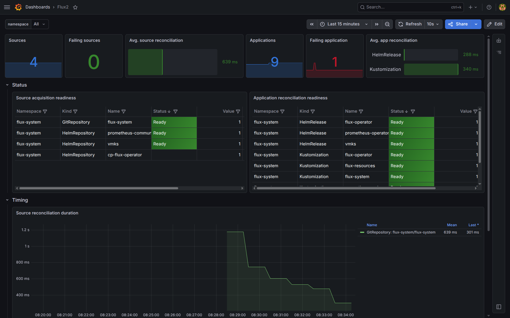

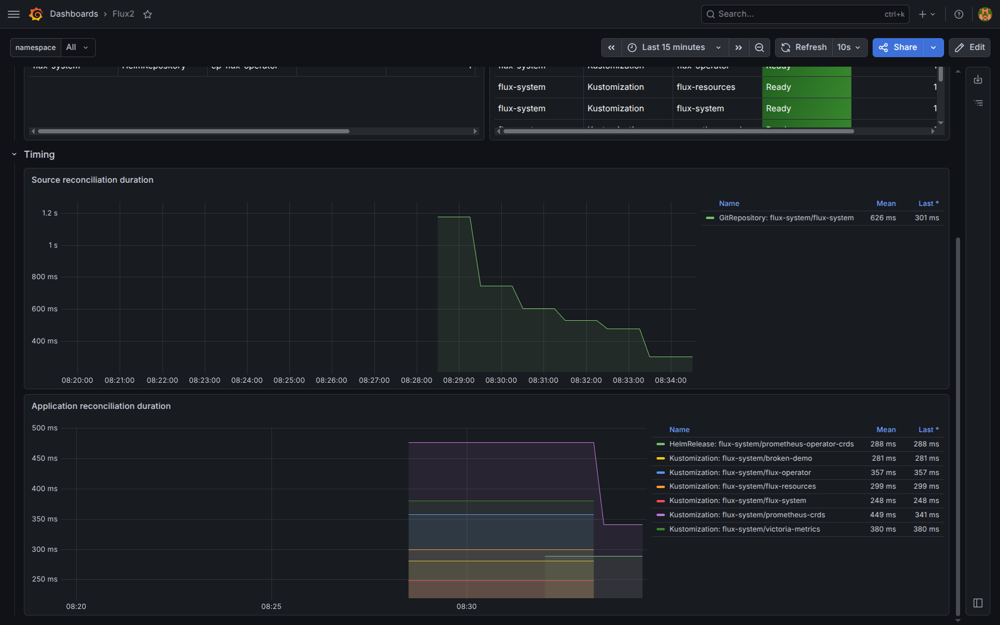

#### Flux Cluster Stats Dashboard

JSON: [`dashboard/cluster.json`](https://github.com/patsevanton/fluxcd-operator-and-status-page/blob/main/dashboard/cluster.json)

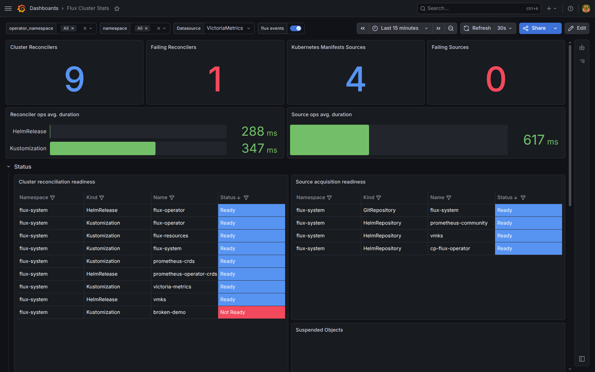

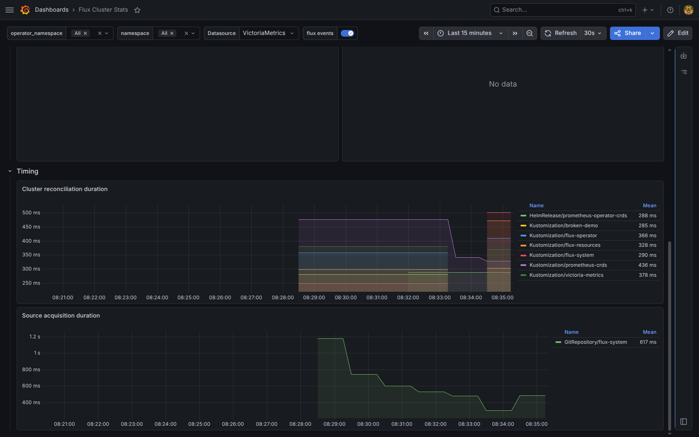

#### Flux Control Plane Dashboard

JSON: [`dashboard/control-plane.json`](https://github.com/patsevanton/fluxcd-operator-and-status-page/blob/main/dashboard/control-plane.json)

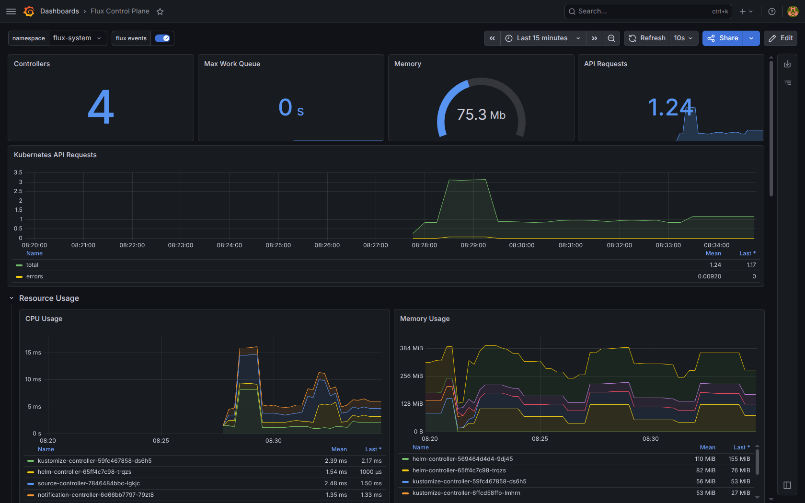

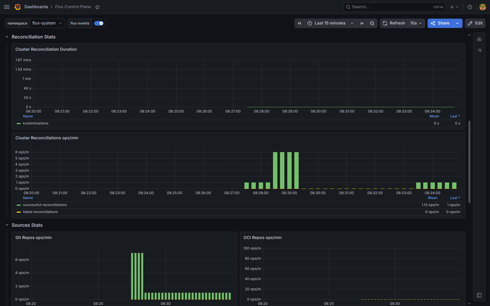

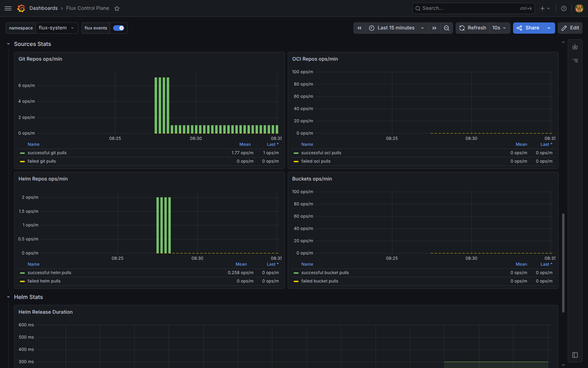

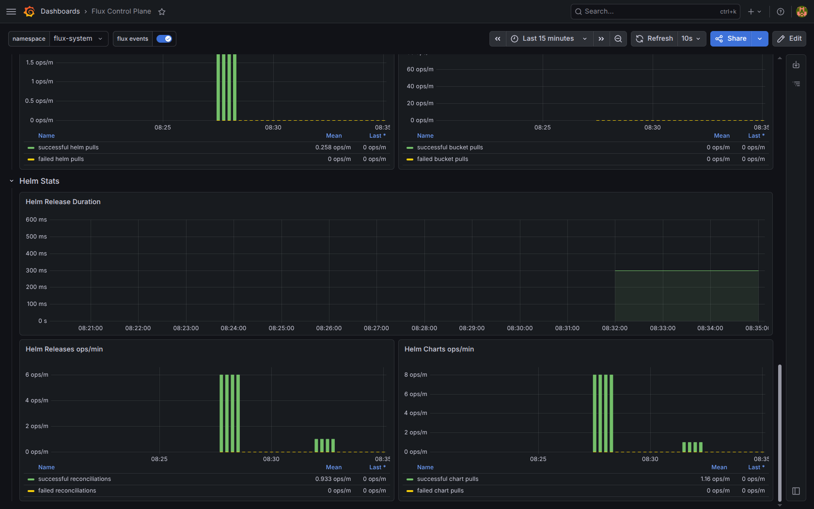

#### Alertmanager Dashboard

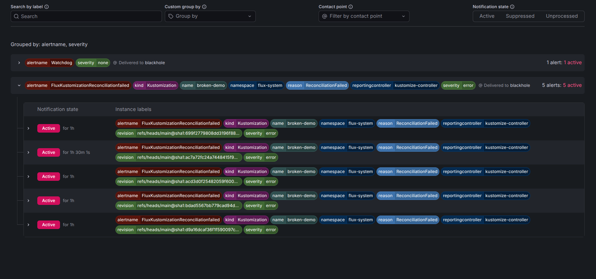

Каждый новый коммит, который приходит в Flux через `GitRepository`, запускает реконсиляцию привязанных `Kustomization` и `HelmRelease`. Если реконсиляция завершается ошибкой (`ReconciliationFailed`), notification-controller отправляет алерт в Alertmanager. Таким образом, в Alertmanager и Grafana вы сразу видите, какой ресурс привёл к сбою.

Чтобы увидеть алерт в Grafana, откройте дашборд Alertmanager и отфильтруйте по `alertname=ReconciliationFailed`.
